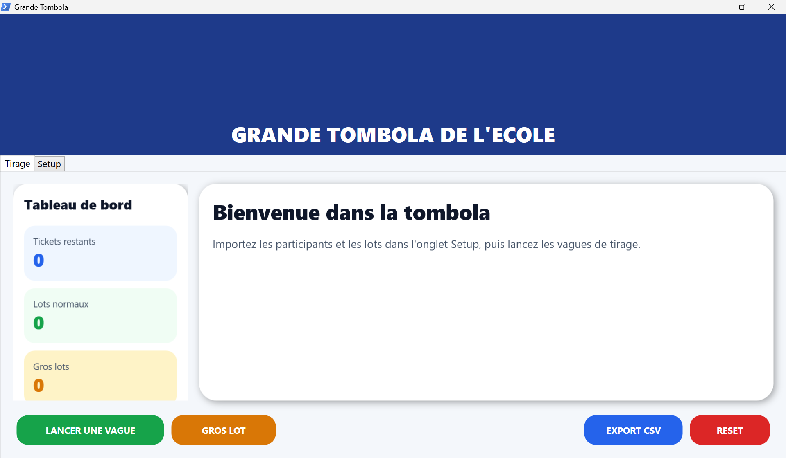

# 🎉 WIN²

> **WIN²** est une application moderne de gestion de tombolas développée en **PowerShell** et **WPF**.
>
> Elle permet d'organiser facilement des tirages de lots, de gérer plusieurs milliers de tickets, d'animer les résultats en direct et d'exporter automatiquement les gagnants.

---

## ✨ Fonctionnalités

- 🎟 Gestion de plusieurs milliers de tickets
- 👥 Plusieurs tickets par participant
- 🎁 Gestion des lots et des gros lots
- 🌊 Tirages organisés par vagues
- ⚙️ Nombre de vagues configurable
- 👤 Affichage des gagnants en mode **groupé** ou **unitaire**
- ⭐ Animation dédiée pour les gros lots
- 💾 Sauvegarde automatique du tirage
- ▶️ Reprise automatique après interruption
- 📄 Export des résultats au format CSV
- 🖼 Personnalisation du titre et de la bannière
- 📊 Tableau de bord en temps réel
- 🖥 Interface moderne optimisée pour un affichage sur vidéoprojecteur

---

# 💡 Pourquoi WIN² ?

WIN² est né d'un besoin très concret.

Les parents élus de notre école organisent pour la première fois une tombola afin de financer différents projets.

Après avoir testé plusieurs solutions, je n'ai trouvé aucun logiciel gratuit répondant réellement à nos besoins.

Les solutions existantes étaient soit, trop limitées ou tout simplement payantes.

Lors de notre dernière tombola, il a fallu près de **3 heures** pour :

- réaliser les tirages,
- vérifier les tickets gagnants,
- noter les résultats,
- les ressaisir sur ordinateur,
- annoncer les gagnants.

Au-delà du temps passé, cette organisation rendait l'animation peu dynamique pour les familles présentes.

L'objectif de WIN² est donc simple :

- automatiser entièrement les tirages ;
- garantir un tirage aléatoire et équitable ;
- rendre l'animation agréable à suivre pour les parents et les enfants ;
- permettre aux bénévoles de se concentrer sur l'événement plutôt que sur l'organisation.

Si WIN² peut aider d'autres écoles, associations, clubs sportifs ou comités d'entreprise à organiser leurs tombolas plus simplement, alors le projet aura pleinement rempli son objectif.

---

# 🚀 Technologies

- PowerShell 5+
- Windows Presentation Foundation (WPF)
- CSV
- JSON

---

# 📸 Aperçu

Des captures d'écran seront ajoutées prochainement.

```
### Écran principal




```

---

# 📋 Roadmap

## Version 1.0

- [x] Gestion des participants
- [x] Gestion des lots
- [x] Gros lots
- [x] Tirages par vagues
- [x] Sauvegarde automatique
- [x] Export CSV
- [x] Configuration persistante
- [x] Interface WPF

## Version X

- [ ] Animation de tirage (roulette)
- [ ] Compte à rebours
- [ ] Confettis
- [ ] Effets sonores
- [ ] Statistiques
- [ ] Historique des tirages
- [ ] Mode sombre
- [ ] Télécommande Android
- [ ] Intégration OBS
- [ ] Mode présentation
- [ ] Version Web

---

# 🤝 Contribuer

Les contributions sont les bienvenues !

N'hésitez pas à :

- proposer une amélioration ;
- signaler un bug ;
- ouvrir une Pull Request ;
- partager vos idées.

---

# 📜 Licence

Ce projet est distribué sous licence **MIT**.

Vous êtes libre de l'utiliser, de le modifier et de le redistribuer dans le respect des conditions de cette licence.

---

# ❤️ Remerciements

Merci à toutes les personnes qui prendront le temps de tester, d'améliorer ou simplement d'utiliser WIN².

J'espère qu'il permettra à d'autres organisateurs de gagner du temps et de rendre leurs événements encore plus conviviaux.

---

**WIN²** — *Organisez. Tirez. Célébrez.*
